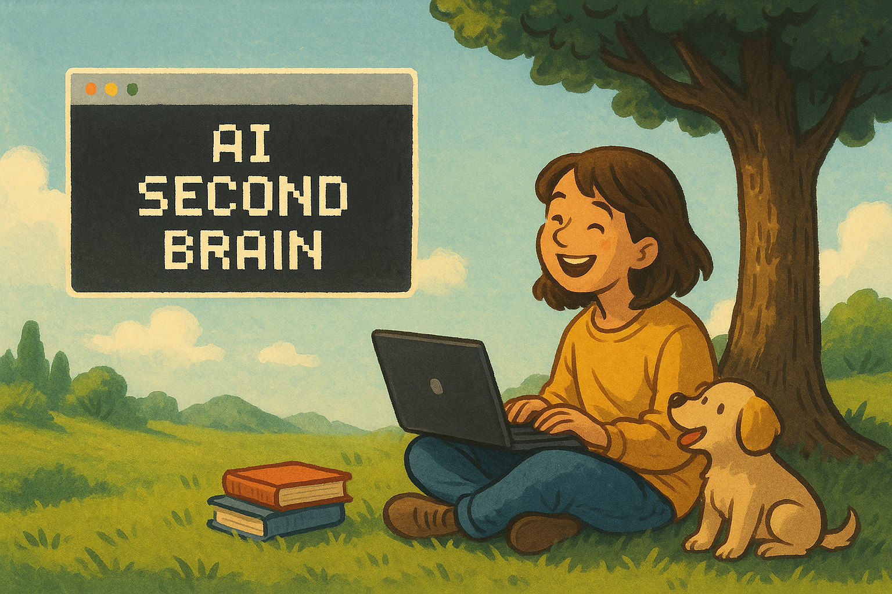

# AI Second Brain

A comprehensive Personal Operating System built on Markdown and powered by AI. While it starts as a simple journal, this system can evolve into a unified knowledge management platform for life management, product development, relationship tracking, task management, and continuous learning. All stored as simple, portable Markdown files with Claude Code as your intelligent layer.

## Getting Started

### Prerequisites

- **Node.js and npm**: Required for Claude Code installation
- **Git**: For version control (optional but recommended)

### Setup

1. **Install Claude Code globally**:
   ```bash
   npm install -g @anthropic-ai/claude-code
   ```

2. **Clone this repository**:
   ```bash
   git clone https://github.com/yourusername/ai-second-brain.git
   cd ai-second-brain
   ```

3. **Start Claude Code** in the project directory:
   ```bash
   claude
   ```

4. **Begin journaling**: Claude will automatically initialize today's journal entry and start a conversation to help you reflect and write.

### Your First Session

When you start Claude Code in this directory:
- It checks for today's journal entry (`journal/YYYY-MM-DD.md`)
- Creates the file if it doesn't exist
- Begins natural conversation to help you reflect and write
- Updates the journal in real-time as you share thoughts

## Core Philosophy

This system operates on a simple but powerful principle: **everything in one place, with AI as your intelligent layer**. Start minimal with just journaling, then expand as needed. Rather than scattering information across dozens of apps, you can build a unified knowledge base where Claude synthesizes insights across all areas of your life.

### Evolution Path
- **Start**: Simple daily journaling (what's included)
- **Expand**: Add task management, goal tracking, note-taking
- **Advanced**: Personal CRM, product development, knowledge synthesis
- **Master**: Full personal operating system with cross-domain intelligence

## File Structure

### Current Minimal Structure
```
ai-second-brain/
├── journal/           # Daily journal entries (YYYY-MM-DD.md)
│   └── README.md      # Journal format and usage guide
├── CLAUDE.md         # AI assistant instructions and personal context
└── README.md         # This file
```

### Possible Expansion (Add as Needed)
```
ai-second-brain/
├── journal/           # Daily journal entries (YYYY-MM-DD.md)
│   └── README.md      # Journal format and usage guide
├── tasks.md          # Kanban-style task management (optional)
├── goals.md          # Multi-timeframe goal hierarchy (optional)
├── people/           # Personal CRM and relationship management (optional)
├── notes/            # Knowledge capture across domains (optional)
│   ├── articles/     # Saved articles and research
│   ├── meetings/     # Meeting notes and follow-ups
│   ├── user-interviews/ # Customer research and insights
│   └── ideas/        # Random thoughts and concepts
├── CLAUDE.md         # AI assistant instructions and personal context
└── README.md         # This file
```

**Key Principle**: Only add folders/files when you actually need them. The system grows with your usage.

## Advanced Use Cases

While this starts as a journal, users have expanded it into:

### 1. Task & Goal Management
Create `tasks.md` with Kanban-style workflow:
```markdown
## In Progress (WIP Limit: 1-3)
| Description | Impact | Effort | Notes |
|-------------|---------|---------|-------|
| [task] | L/M/H | L/M/H | [justification] |

## Backlog
| Description | Impact | Effort | Notes |
|-------------|---------|---------|-------|
| [prioritized tasks] | L/M/H | L/M/H | [reasoning] |
```

Add `goals.md` for multi-timeframe planning (10-year vision down to monthly focus).

### 2. Personal CRM
Create `people/` folder with individual profiles tracking:
- Personal details and communication history
- Important dates and collaboration notes
- Claude can generate conversation starters and follow-up reminders

### 3. Product Development Pipeline
Use `notes/user-interviews/` to capture customer research, then:
- Claude synthesizes patterns and insights
- Generate PRDs from user needs
- Trace every feature back to original research

### 4. Knowledge Synthesis
Claude can analyze across all your notes to:
- Generate blog posts from accumulated insights
- Surface forgotten connections and ideas
- Create comprehensive analysis from your knowledge base

### 5. Templates & Consistency
Add `template.md` and `README.md` files in folders for:
- Consistent formatting across content types
- Self-documenting workflows
- Easy onboarding for new areas

**Note**: The `journal/README.md` contains the standard journal entry template and formatting guidelines.


## AI Integration

Claude Code serves as your **intelligent layer** across all content. As you expand the system, it can:

### Cross-System Analysis
- **Task Prioritization**: Compare current tasks against goal hierarchy
- **Relationship Management**: Update people profiles from journal mentions
- **Content Generation**: Create blog posts from synthesized insights
- **Pattern Recognition**: Identify trends across all your notes

### Daily Workflow
1. **Check-in**: Review today's journal and current priorities
2. **Goal Alignment**: Assess if work aligns with larger objectives
3. **Knowledge Updates**: Connect new insights to existing notes
4. **Relationship Notes**: Surface follow-ups for important people
5. **Commit**: Save progress at natural stopping points

### Expansion Strategy
**Start Simple**: Use just the journal for daily reflection
**Add Gradually**: When you find yourself needing task management, add `tasks.md`
**Grow Organically**: Let your actual usage patterns guide what folders to create
**Stay Minimal**: Only add structure when it provides clear value

## Why This Approach Works

### The Compound Effect
Every conversation makes the system smarter. As you build context across domains, Claude becomes increasingly effective at connecting patterns and generating insights.

### Key Advantages
- **No Vendor Lock-in**: Just Markdown files, works anywhere
- **Infinite Customization**: You control structure and workflows
- **Cross-Domain Intelligence**: One AI that knows your entire context
- **Portable & Durable**: Version controlled, backed up, future-proof
- **Cost Effective**: Replaces multiple productivity subscriptions

### Potential Outcomes
Advanced users have evolved this into a complete **Personal Operating System** that serves as:
- External memory and knowledge base
- Task and goal management system
- Relationship and networking hub
- Product development pipeline
- Creative thinking partner
- Accountability and reflection tool

## Frequently Asked Questions

### Q: Do I need to create all the folders mentioned in the documentation?
**A**: No! Start with just the journal folder. Only add additional folders (tasks.md, goals.md, people/, notes/) when you actually need them. The system grows with your usage.

### Q: What if I miss a day of journaling?
**A**: No problem! Just pick up where you left off. Claude will create the entry for any date you want to work on. The system is flexible and non-judgmental.

### Q: Can I use this without Claude Code?
**A**: While designed for Claude Code, all files are standard Markdown so you can edit them with any text editor. You'll miss the AI integration features, but the structure still works for manual journaling.

### Q: How do I backup my data?
**A**: Since everything is in Git, your entire system is automatically backed up. You can also sync to GitHub, GitLab, or any other Git hosting service for additional redundancy.

### Q: What's the difference between this and other note-taking apps?
**A**: This system provides unified, AI-assisted knowledge management across all life domains in portable Markdown files. No vendor lock-in, infinite customization, and one AI assistant that knows your entire context.

### Q: How do I handle sensitive information?
**A**: You control all the data. Keep sensitive notes in private repositories or local-only folders. The system works entirely with files you own and control.

### Q: Can multiple people use the same system?
**A**: Each person should have their own repository since it's designed for personal knowledge management. However, you could share specific folders or notes for collaboration.

### Q: What if I want to change the structure later?
**A**: Everything is just Markdown files! You can reorganize, rename, or restructure anytime. Git history preserves your changes, and Claude adapts to your new organization.

## Core Benefits

- **Unified Knowledge**: Everything connected in one system
- **AI-Enhanced Thinking**: Intelligent synthesis across all domains
- **Goal Alignment**: Tasks stay connected to bigger picture
- **Relationship Intelligence**: Meaningful follow-ups and connections
- **Knowledge Leverage**: Past insights inform present decisions
- **Personal Growth**: Daily reflection builds self-awareness
- **Simplicity**: Plain Markdown files, no complex dependencies

Start with journaling, expand as needed. The system grows with you.